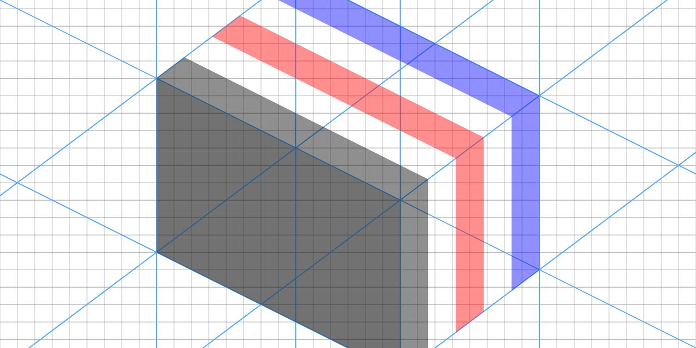
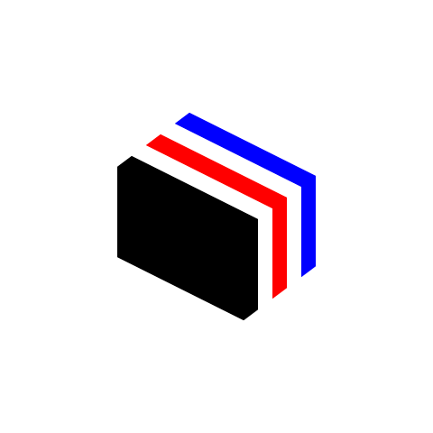

<!--
SPDX-FileCopyrightText: 2024 Koki Takahashi <hakatasiloving@gmail.com>

SPDX-License-Identifier: CC-BY-4.0
-->

# hakatashi's icon gallery

## Specification

### Shape

The original icon of hakatashi consists of the three polygons: Black, Red, Blue.

Assuming that the whole canvas is the square with 480 width and 480 height, the points of the polygons must have the following exact geometric value. (Annotated by (x, y) notation, where the top-left corner is (0, 0))

#### Black Polygon

* (130, 185)
* (146, 173)
* (286, 243)
* (286, 343)
* (270, 355)
* (130, 285)

#### Red Polygon

* (162, 161)
* (178, 149)
* (318, 219)
* (318, 319)
* (302, 331)
* (302, 231)

#### Blue Polygon

* (194, 137)
* (210, 125)
* (350, 195)
* (350, 295)
* (334, 307)
* (334, 207)

### Color

The colors of the background and the polygons depend on implementations, but should preferably similar to the following color value in the RGB color space.

* Background: R: 255, G: 255, B: 255
* Black Polygon: R: 0, G: 0, B: 0
* Red Polygon: R: 255, G: 0, B: 0
* Blue Polygon: R: 0, G: 0, B: 255

### Sample Image

### Reference Implementation by SVG 2

* [icon.svg](icon.svg)

