

[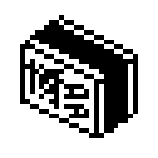](2nd_gen/blackline.png)

[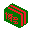](2nd_gen/christmas.png)
[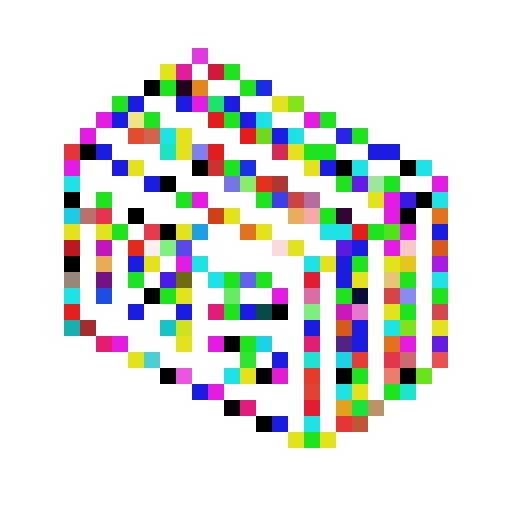](2nd_gen/color.png)

[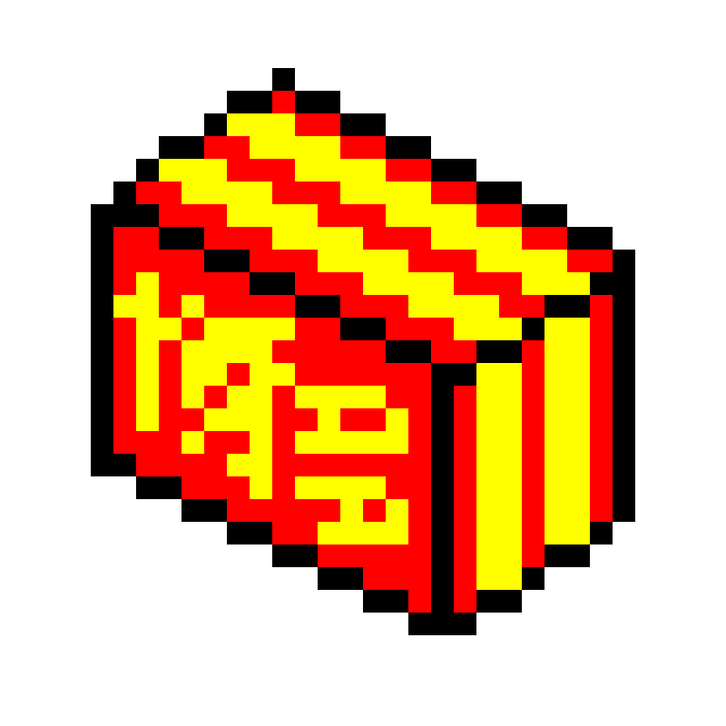](2nd_gen/red_yellow.png)

[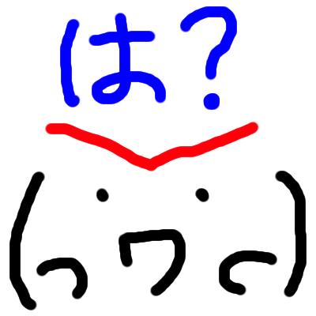](3rd_gen/cookies.png)
[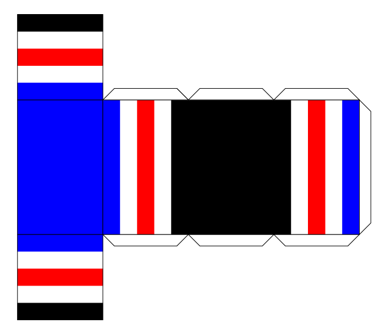](3rd_gen/expansion_plan.png)

[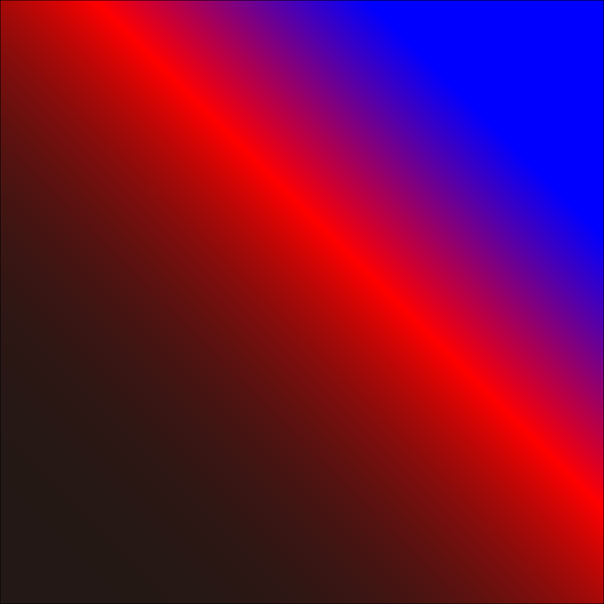](3rd_gen/gradation.png)

[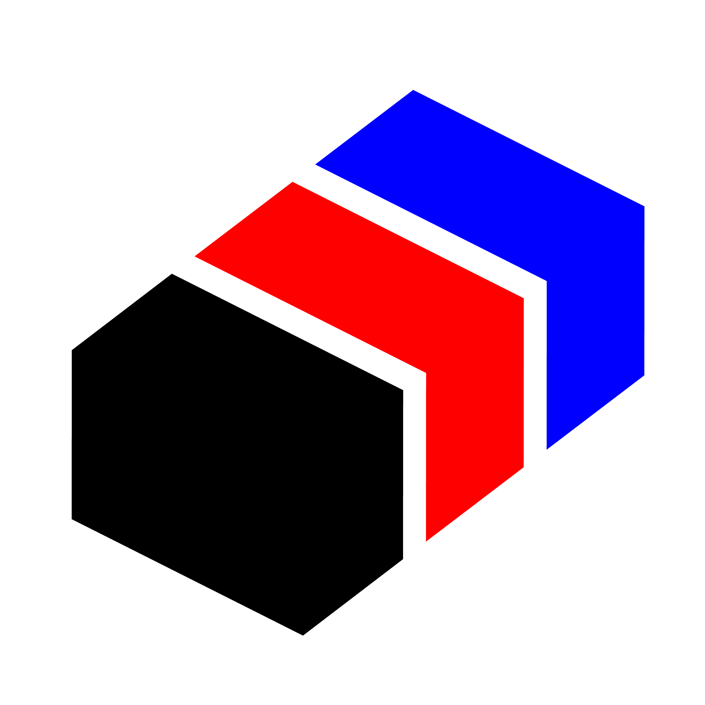](3rd_gen/long.png)

[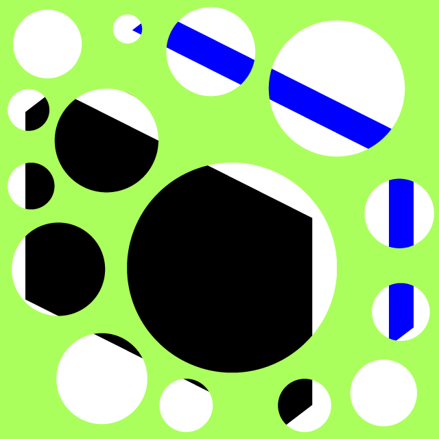](3rd_gen/mizutama.png)

[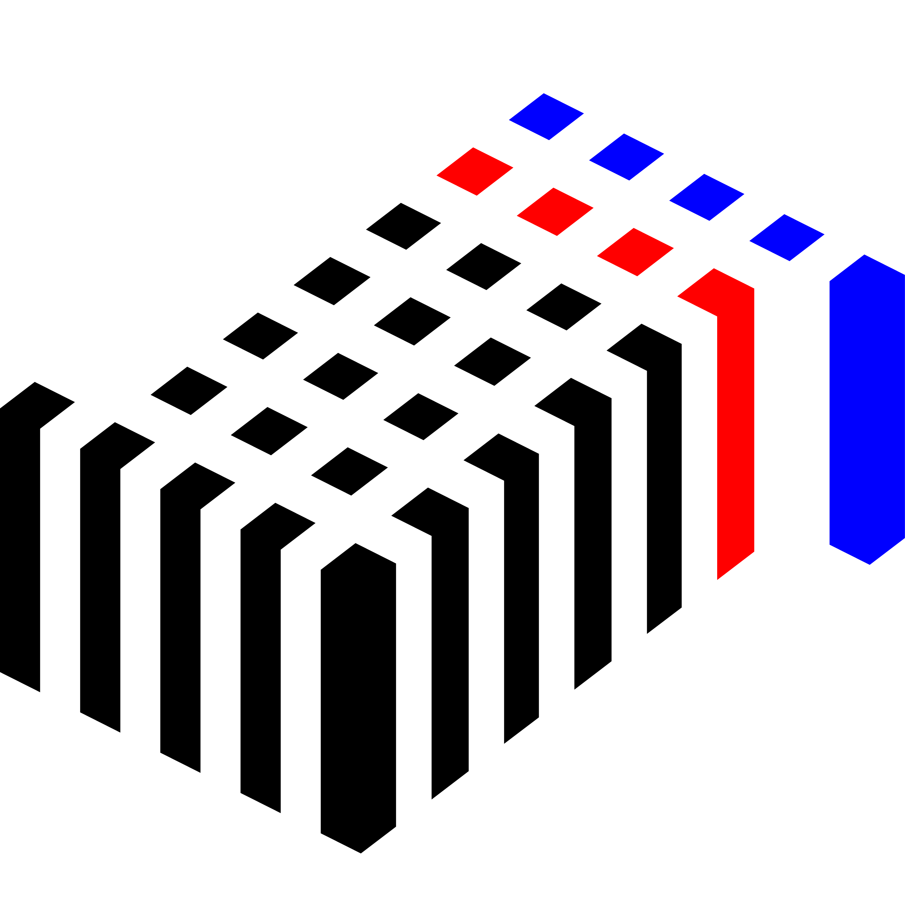](3rd_gen/month_november.png)
[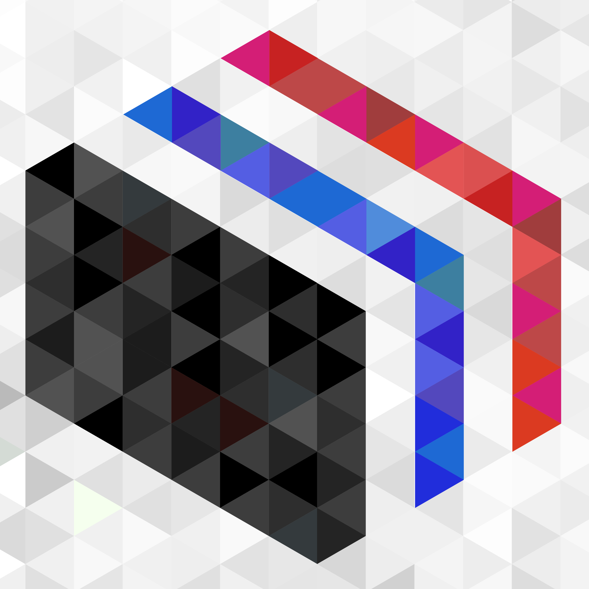](3rd_gen/mosaic.png)

[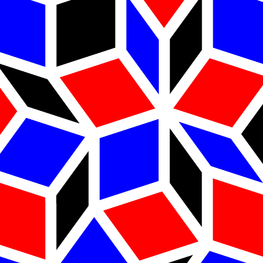](3rd_gen/penrose_small.png)

[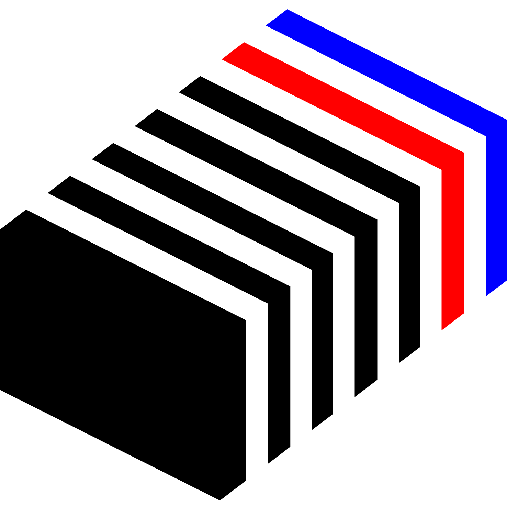](3rd_gen/week.png)

[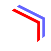](3rd_gen/white.png)

[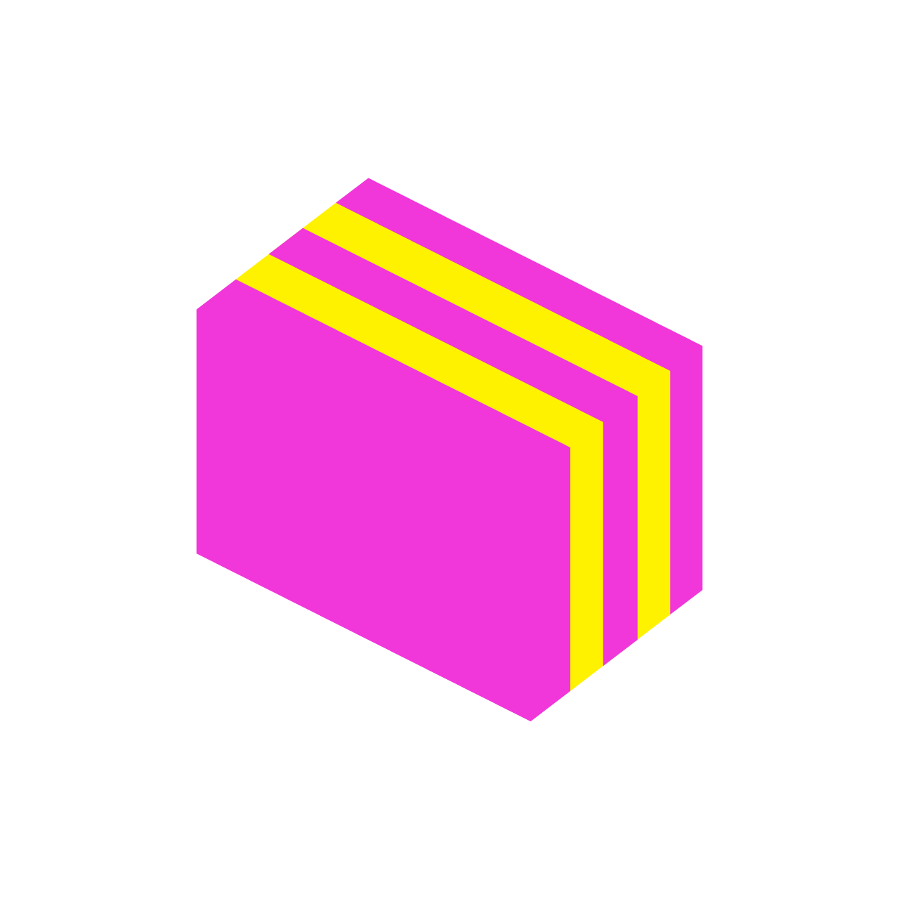](3rd_gen/yuruyuri.png)

[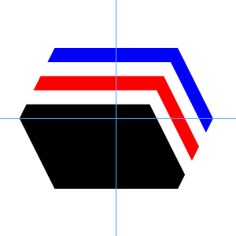](4th_gen/dimension_3.png)

[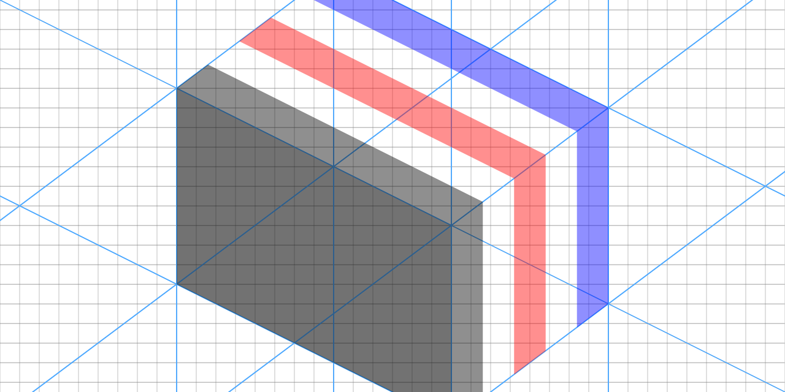](ogimage.png)
